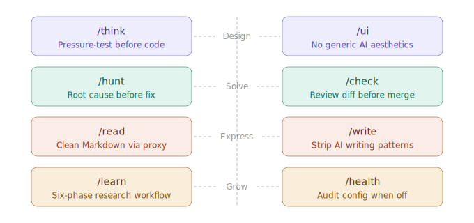

<div align="center">
  
  <h1>Waza</h1>
  <p><b>把你已经熟悉的工程习惯，变成 AI agents 可以执行的 skills。</b></p>
  <a href="https://github.com/tw93/Waza/actions/workflows/test.yml"></a>
  <a href="https://github.com/tw93/Waza/stargazers"></a>
  <a href="https://github.com/tw93/Waza/releases"></a>
  <a href="LICENSE"></a>
  <a href="https://twitter.com/HiTw93"></a>
</div>

<br/>

## 为什么

Waza（技, わざ）是日本武术里的“技”：反复练习，直到动作变成本能。

好的工程师不只是写代码。他们会想清需求，审查自己的工作，系统性调试，设计有明确意图的界面，并阅读一手资料。他们写得清楚，也通过产出而不是消费内容来学习新领域。

AI 在原始产出能力上已经强过大多数工程师。但没有结构时，这种能力很容易滑向泛泛而谈和不精确的工作。Waza 把它收束到精确的工程习惯里：八个 skills 先设清目标和约束，再让模型做它最擅长的事。

三部曲的一部分：[Kaku](https://github.com/tw93/Kaku)（書く）写代码，[Waza](https://github.com/tw93/Waza)（技）训练习惯，[Kami](https://github.com/tw93/Kami)（紙）交付文档。可以把它们想成一家人：Kaku 是爸爸，Waza 是姐姐，Kami 是妹妹。

<div align="center">
  
</div>

## Skills

每个工程习惯都对应一个安装好的 skill。在 Claude Code 里输入 slash command。在 Codex 里按名称调用已安装的 skill，并沿用同一套 playbook。

| Skill | 何时使用 | 作用 |
| :--- | :--- | :--- |
| [`/think`](skills/think/SKILL.md) | 构建任何新东西之前 | 挑战问题、压力测试设计，并产出另一个 agent 可以直接执行的决策完备计划。 |
| [`/ui`](skills/ui/SKILL.md) | 构建前端界面 | 产出有辨识度的 UI，包括基于截图的审美迭代，方向明确，而不是套用泛化默认值。 |
| [`/check`](skills/check/SKILL.md) | 任务完成后、合并或发布前 | 审查 diff，提炼项目特定约束，处理已批准的 release/publish/push/reaction 收尾，并用证据验证。 |
| [`/hunt`](skills/hunt/SKILL.md) | 任何 bug、回归或异常行为 | 系统性调试。先确认 root cause，再应用任何 fix，尤其适用于以前能工作的东西。 |
| [`/write`](skills/write/SKILL.md) | 写作或编辑 prose | 重写中文和英文 prose，使其自然，删掉僵硬、模板化的表达。 |
| [`/learn`](skills/learn/SKILL.md) | 深入陌生领域 | 六阶段研究 workflow：收集、消化、拟提纲、填充、精修，然后自审并准备发布。 |
| [`/read`](skills/read/SKILL.md) | 任何 URL 或 PDF | 按平台特性路由读取 URL 和 PDF。普通读取返回简洁总结；当用户要求转换、引用、保存或供下游工作使用时输出 Markdown。 |
| [`/health`](skills/health/SKILL.md) | 审计 Agent Health | 检查 Codex、Claude Code、项目指令、verifier 输出和 AI maintainability，在深度检查前做预算感知的摘要扫描。 |

每个 skill 都是一个文件夹，里面有 reference docs、helper scripts，以及来自真实失败的 gotchas。

## 安装和更新

一条命令会无提示、无报错地安装全部八个 skills。复制并运行：

```bash
npx skills add tw93/Waza -a claude-code codex cursor -g -y
```

这会安装到 Claude Code、Codex 和 Cursor，也会被其他读取共享 `~/.agents/skills` 目录的 agent 使用。后续可用 `npx skills update -g -y` 更新，或传入单个 agent（例如 `-a claude-code`）来限定范围。

**Native plugin**（用于 host-native update commands）

```bash
# Claude Code: install, then `claude plugin update waza`
/plugin marketplace add tw93/Waza
/plugin install waza@waza

# Codex: install, then `codex plugin marketplace upgrade waza`
codex plugin marketplace add tw93/Waza
codex plugin add waza@waza
```

**Claude Desktop**：下载 [waza.zip](https://github.com/tw93/Waza/releases/latest/download/waza.zip)，然后打开 Customize > Skills > "+" > Create skill，并上传 ZIP。更新时重新上传最新版 ZIP。

**Pi**: `pi install npm:@tw93/waza` (update with `pi update npm:@tw93/waza`). `/health` audits Pi settings alongside Claude Code and Codex.

**Pi**：`pi install npm:@tw93/waza`（使用 `pi update npm:@tw93/waza` 更新）。`/health` 会和 Claude Code、Codex 一起审计 Pi settings。

如果想收到新版本通知，watch Waza 的 [GitHub Releases](https://github.com/tw93/Waza/releases)。

## Project Context

Waza 把通用程序员习惯保留在公开 skill 内。`/check` 通过读取目标仓库的公开上下文和用户任务约束，变得 project-aware。

- Project commands 来自 README、package manifests、Makefiles、CI workflows 和用户明确指令。
- Project hard stops 包括 generated artifacts、protected files、version synchronization、release assets 和领域特定 safety risks。
- Public docs 和示例不得包含 credentials、certificate paths、private key filenames、tokens 或个人机器细节。

review context template 见 [`skills/check/references/project-context.md`](skills/check/references/project-context.md)。

## 串联 Skills

Skills 被设计成可以串联，但切换是手动的。每个 skill 完成自己的任务后都会停下，等待你决定下一步。

**常见 workflows：**

- **设计一个功能**：`/think` → approve → 说 "implement X" → `/check` → merge
- **交付一个 fix**：`/hunt` → fix → `/check` → release/publish/push/issue follow-through
- **研究并写作**：`/read`（fetch sources）→ `/learn`（synthesize）→ `/write`（polish）
- **调试并验证**：`/hunt`（find root cause）→ fix → `/check`（review changes）

每个箭头都代表一次手动用户动作。Skills 不会自动互相触发。

## 额外功能

### Statusline

Claude Code 的极简 statusline：context window、5-hour quota 和 7-day quota。按使用量着色，没有进度条，没有噪音。

<div align="center">
  
</div>

```bash
curl -sL https://github.com/tw93/Waza/releases/latest/download/setup-statusline.sh | bash
```

**Codex** 有原生 statusline items。添加到 `~/.codex/config.toml`：

```toml
[tui]
status_line = ["model-with-reasoning", "current-dir", "context-used", "five-hour-limit", "weekly-limit"]
status_line_use_colors = true
```

Codex 显示剩余额度；上面的 Claude Code statusline 显示已用百分比（upstream 还没有暴露 `five-hour-used` / `weekly-used`）。

### Optional Rules

三个彼此独立的开关。复制你需要的命令即可（Codex 用户把 `claude-code` 换成 `codex`）：

```bash
# English coaching: appends a short 😇 correction when your prompt has an English mistake
curl -sL https://github.com/tw93/Waza/releases/latest/download/setup-rule.sh | bash -s -- english claude-code

# Anti-patterns: always-on cross-skill guardrails (read before acting, no scope creep, no unsolicited summaries)
curl -sL https://github.com/tw93/Waza/releases/latest/download/setup-rule.sh | bash -s -- anti-patterns claude-code

# Routing hint: tells non-Claude hosts to prefer Waza skills when a request matches their triggers
curl -sL https://github.com/tw93/Waza/releases/latest/download/setup-rule.sh | bash -s -- waza-routing claude-code
```

<div align="center">
  
</div>

Curl URLs 使用最新 GitHub release asset。如果想使用 bleeding-edge scripts，请在运行命令前设置 `WAZA_REF=main`。

## Why

Waza (技, わざ) is a Japanese martial arts term for technique: a move practiced until it becomes instinct.

A good engineer does more than write code. They pressure-test requirements, debug to root cause, review their own diffs, and read primary sources. AI has the raw output for all of it, but without structure that output drifts into generic, imprecise work. Each Waza skill sets a clear goal and the constraints that matter, then steps back and lets the model work. As models improve, that restraint pays compound interest.

Tools like Superpowers and gstack are powerful but heavy: too many skills, too much configuration. Waza stays small, eight skills for the habits that actually matter, each with one job and a clear trigger. Built from real projects and refined through 300+ sessions across 7 projects, every gotcha traces to a real failure. The `/health` skill grew from the six-layer Claude Code framework in [this post](https://tw93.fun/en/2026-03-12/claude.html).

Part of a trilogy: [Kaku](https://github.com/tw93/Kaku) (書く) writes code, [Waza](https://github.com/tw93/Waza) (技) drills habits, [Kami](https://github.com/tw93/Kami) (紙) ships documents. Think of them as a family: Kaku is the dad, Waza the big sister, Kami the little sister.

## Uninstall

```bash
npx skills remove tw93/Waza -g
rm -f ~/.claude/statusline.sh
rm -f ~/.claude/rules/english.md
rm -f ~/.claude/rules/anti-patterns.md
rm -f ~/.claude/rules/waza-routing.md
```

Claude Desktop 用户从 Customize > Skills 删除 Waza。Codex rule installs 则从 `~/.codex/AGENTS.md` 中删除带标记的 Waza blocks。

## 背景

Superpowers 和 gstack 这样的工具很厉害，但也很重：skills 太多、配置太多、学习曲线太陡。

作者写下的每条 rule 也是一个上限。模型只能做指令允许它做的事。Waza 反过来：每个 skill 只设清目标和真正重要的约束，然后退后一步。随着模型变强，这种克制会产生复利。

八个 skills，对应真正重要的习惯。每个只做一件事，有清晰 trigger，并且不挡路。它们来自真实项目，在 7 个项目的 300+ sessions 中打磨。每个 gotcha 都能追溯到一次真实失败。

`/health` skill 源自 [这篇文章](https://tw93.fun/en/2026-03-12/claude.html) 描述的六层 Claude Code framework，现在覆盖 Codex、Claude Code、Pi、verifier surfaces 和 AI maintainability。

## Support

- 支持作者最直接的方式，是购买我的付费 Mac 清理应用 [Mole for Mac](https://mole.fit)。
- 如果 Waza 帮到了你，可以[分享给朋友](https://twitter.com/intent/tweet?url=https://github.com/tw93/Waza&text=Waza%20-%20AI%20coding%20skills%20for%20the%20complete%20engineer.)，或给它一个 star。
- 有想法或 bug？欢迎开 issue 或 PR，也欢迎贡献你最喜欢的 AI model。
- 我有两只猫，TangYuan 和 Coke。如果你觉得 Waza 让生活更开心，可以给它们投喂<a href="https://cats.tw93.fun?name=Waza" target="_blank">罐头 🥩</a>。

<details>
<summary>这些可爱的人已经投喂过 🐱</summary>
<br/>
<div align="center">
  <a href="https://cats.tw93.fun?name=Waza"></a>
</div>
</details>

## License

MIT License。欢迎使用 Waza，也欢迎贡献。
